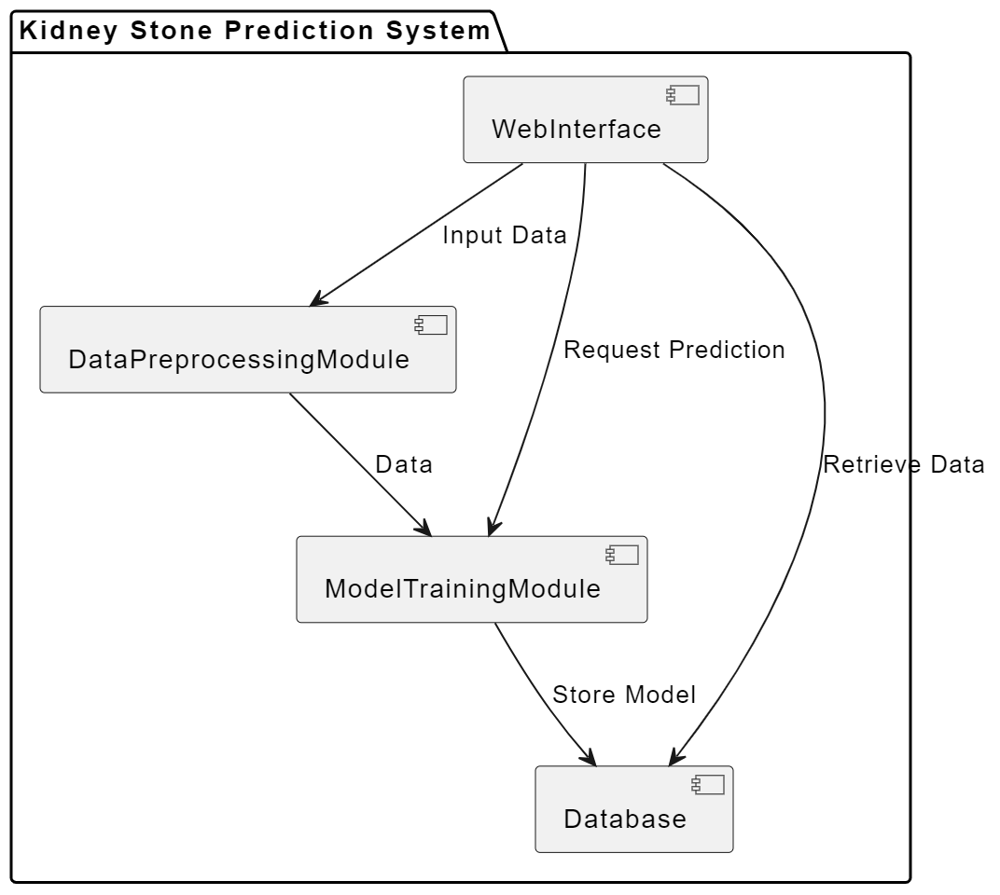
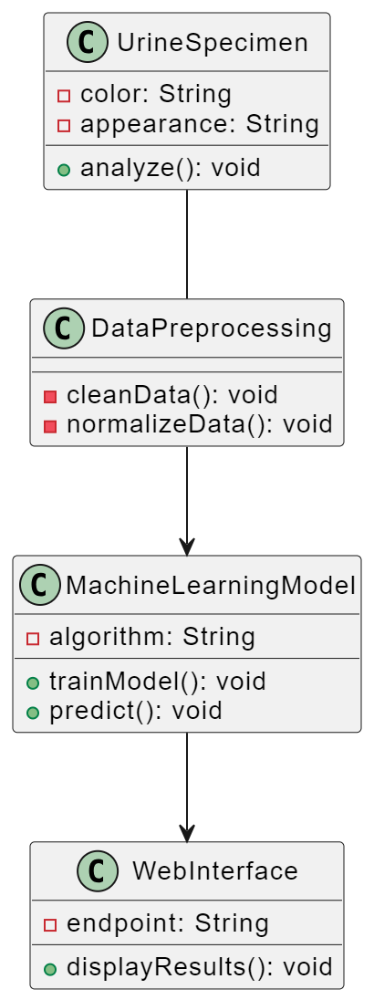
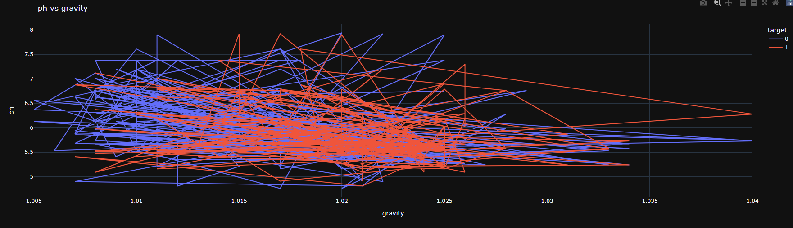
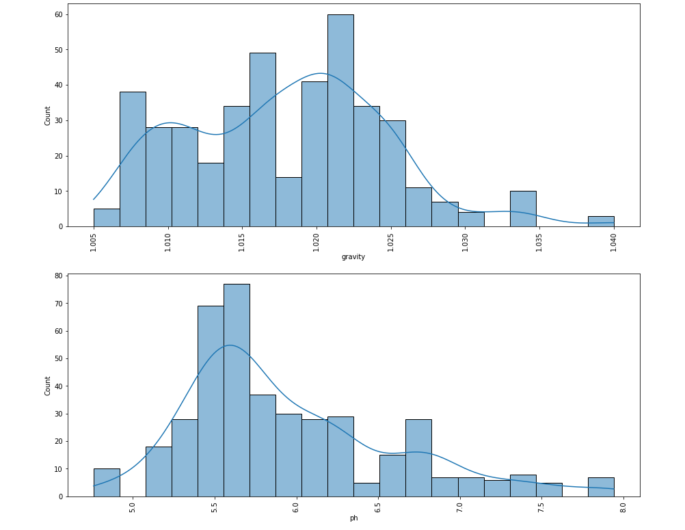
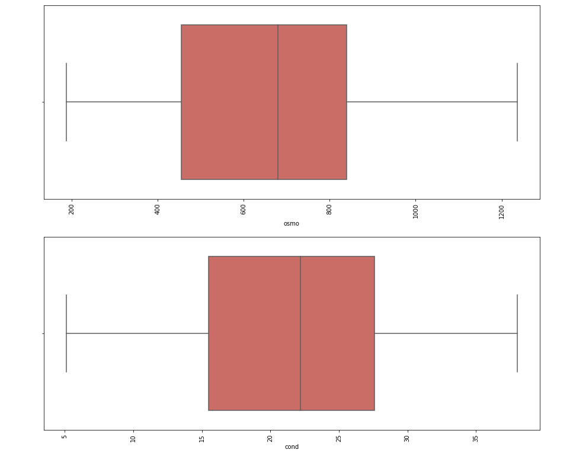

# 🧠 Kidney Stone Prediction Web App

## 🔍 Overview

This project focuses on early **detection of kidney stones** using **Machine Learning (ML)** and **Deep Learning (DL)** models, deployed via a simple and interactive **Streamlit** web interface. It is designed to assist both patients and healthcare professionals in identifying risks based on **urine specimen characteristics**.

Kidney stones, often painful and recurring, affect millions globally. This app aims to address delays in diagnosis by offering fast and data-driven predictions using easily measurable urine parameters like:
- Specific gravity
- pH
- Osmolarity
- Calcium concentration

---

## 🌐 Tech Stack

- **Python**
- **Pandas / NumPy / Matplotlib**
- **Scikit-learn / TensorFlow / Keras**
- **Streamlit**
- **Streamlit Cloud (for deployment)**

---

## 📈 Features

- Upload or enter patient urine test values
- Instant ML/DL-based prediction of kidney stone likelihood
- User-friendly web interface (Streamlit)
- Deployed on **Streamlit Cloud** for easy access
- Supports both **classification** and **probability score visualization**

---

## 🚀 Social Impact

🏥 Kidney stone-related complications account for thousands of hospital visits each year. This project provides a fast, accessible, and preventive digital diagnostic tool that can reduce delays in treatment and enhance healthcare accessibility—especially in underserved areas.

---

## 🖼️ Screenshots

### 📌 Component Diagram  

### 📌 UML Diagram  

### 📌 Parameter Graphs  

---

## 👨‍💻 Author

**Tanmay Arya**  
🎓 Duke University – MQM '26  
📊 Passionate about Data Analytics, ML, and Social Impact
